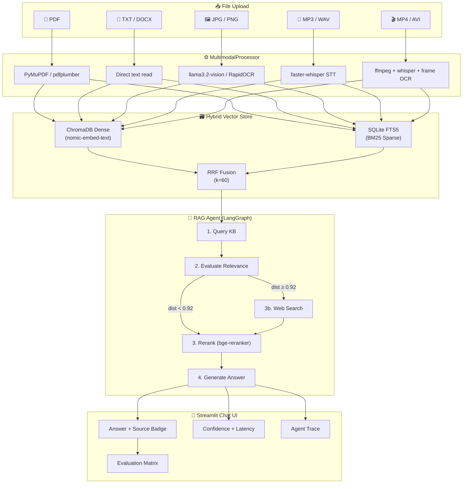
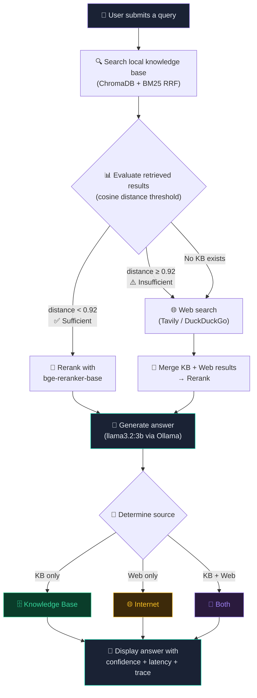

# 🔮 NexusRAG – Agentic Multimodal RAG System

A production-grade **Agentic Retrieval-Augmented Generation** system that ingests content
across **five modalities** (PDF, Text, Image, Audio, Video), builds a unified searchable
knowledge base, and answers questions using an **agent-driven retrieval pipeline** —
automatically falling back to **live web search** when local context is insufficient.

---

## ✨ Key Features

| Feature | Implementation |
|---|---|
| 📄 PDF Ingestion | PyMuPDF (primary) → pdfplumber → PyPDF2 (fallback chain) |
| 📝 Text / DOCX | Direct extraction via python-docx |
| 🖼️ Image OCR | llama3.2-vision (primary) → RapidOCR → EasyOCR → pytesseract |
| 🎵 Audio STT | faster-whisper base (CTranslate2, 16kHz mono preprocessing) |
| 🎬 Video STT + OCR | ffmpeg audio extraction → faster-whisper + RapidOCR frame sampling |
| 🤖 Agentic Pipeline | LangGraph StateGraph: KB → relevance eval → web fallback |
| 🗄️ Source Attribution | Answers labelled as **Knowledge Base** / **Internet** / **Both** |
| 📊 Confidence Score | High / Medium / Low based on cosine distance |
| ⏱️ Latency Tracking | Per-query response time shown in UI |
| 🔍 Agent Trace | Step-by-step trace of the agent's decision process |
| 🔢 Hybrid Retrieval | ChromaDB dense + SQLite FTS5 BM25 sparse + RRF fusion |
| 🔀 Cross-encoder Reranker | BAAI/bge-reranker-base for result reranking |
| 🌐 Web Fallback | Tavily API (primary) → DuckDuckGo (free fallback) |
| 🎯 Question Types | 11 auto-detected types with format-specific prompts |
| 📊 Evaluation Matrix | Token F1 · ROUGE-1/2/L · Semantic Similarity · Exact Match |
| 💬 Chat Interface | Streamlit chat-style UI with full conversation history |

---

## 🏗️ System Architecture



---

## 🤖 Agent Workflow



### Agent Decision Logic

```
User submits a query
       │
       ▼
Query local knowledge base (ChromaDB + BM25 → RRF fusion)
       │
       ├─ best cosine distance < 0.92  →  🗄️  Answer from KB only
       │
       ├─ KB is empty                  →  🌐  Web search only
       │
       └─ distance ≥ 0.92             →  🔀  KB + Web search combined
                                              → Rerank all candidates
                                              → Generate answer
                                              → Cite both sources
```

The agent always indicates the answer source with a badge so users know exactly where the information came from.

---

## 🌐 Web Search Fallback Mechanism

The system uses a **two-tier web search fallback** to ensure answers are always available:

### How it works

1. **Primary: Tavily API** — If a `TAVILY_API_KEY` is set in the sidebar, the agent uses Tavily's search API for high-quality, structured web results.

2. **Secondary: DuckDuckGo** — If no Tavily key is configured (or if Tavily fails), the agent automatically falls back to DuckDuckGo's free search API, requiring no API key.

3. **Toggle Control** — The sidebar includes a **Web fallback toggle** that lets users enable or disable web search entirely. When disabled, the agent only answers from the local knowledge base.

### When web search triggers

| Condition | Action |
|---|---|
| KB has relevant chunks (distance < 0.92) | ✅ Answer from KB only |
| KB has chunks but low relevance (distance ≥ 0.92) | 🔀 Supplement with web search |
| No KB exists or KB is empty | 🌐 Web search only |
| Web fallback toggle is OFF | 🗄️ KB only (no web search) |

### Result integration

Web results are formatted as context chunks (`[Web Result N]`) and fed into the same reranking pipeline. The cross-encoder (bge-reranker-base) scores both KB chunks and web results together, ensuring the most relevant information rises to the top regardless of source.

---

## 🛠️ Technologies Used

| Category | Technology | Purpose |
|---|---|---|
| **UI Framework** | Streamlit | Chat-style web interface |
| **LLM** | llama3.2:3b (Ollama) | Answer generation |
| **Vision Model** | llama3.2-vision (Ollama) | Image understanding |
| **Embeddings** | nomic-embed-text (Ollama) | Dense vector embeddings |
| **Fallback Embeddings** | all-MiniLM-L6-v2 | Sentence-transformer fallback |
| **Vector Database** | ChromaDB | Dense cosine similarity search |
| **Lexical Search** | SQLite FTS5 | BM25 sparse retrieval |
| **Fusion** | Reciprocal Rank Fusion (k=60) | Merging dense + sparse results |
| **Reranker** | BAAI/bge-reranker-base | Cross-encoder result reranking |
| **PDF Extraction** | PyMuPDF / pdfplumber / PyPDF2 | Text extraction from PDFs |
| **Image OCR** | RapidOCR / EasyOCR / pytesseract | Optical character recognition |
| **Speech-to-Text** | faster-whisper (CTranslate2) | Audio transcription |
| **Audio Extraction** | ffmpeg / moviepy | Video → audio conversion |
| **Web Search** | Tavily API / DuckDuckGo | Internet fallback search |
| **Agent Orchestration** | LangGraph StateGraph | Agentic pipeline workflow |
| **Evaluation** | rouge-score / sentence-transformers | NLP evaluation metrics |
| **DOCX Support** | python-docx | Word document extraction |

---

## 📋 Prerequisites

| Requirement | Version | Check command |
|---|---|---|
| Python | ≥ 3.10 | `python --version` |
| pip | ≥ 23 | `pip --version` |
| Ollama | latest | `ollama --version` |
| llama3.2:3b model | — | `ollama list` |
| ffmpeg *(audio/video)* | any | `ffmpeg -version` |

> **ffmpeg note:** Install via `pip install imageio-ffmpeg` — no system install needed.

> **Hardware:** llama3.2:3b runs on CPU (slow) or GPU/Apple Silicon (fast). Minimum 8 GB RAM.

---

## 🚀 Setup Instructions

### Step 1 — Clone or download the project

```
nexusrag/
├── app.py                    # Streamlit chat-style UI
├── multimodal_processor.py   # Extracts text from all modalities
├── vector_store.py           # ChromaDB + BM25 hybrid retrieval
├── qa_engine.py              # Ollama LLM caller + question-type prompts
├── agent.py                  # LangGraph agentic pipeline
├── web_search.py             # Tavily + DuckDuckGo web search
├── evaluator.py              # 8-metric NLP evaluation engine
├── document_processor.py     # Legacy PDF/TXT processor
└── requirements.txt          # All Python dependencies
```

### Step 2 — Create a virtual environment

```bash
cd nexusrag

python -m venv .venv

# macOS / Linux:
source .venv/bin/activate

# Windows (PowerShell):
.venv\Scripts\Activate.ps1
```

### Step 3 — Install dependencies

```bash
pip install --upgrade pip
pip install -r requirements.txt
```

### Step 4 — Install and start Ollama

**macOS:**
```bash
brew install ollama
```

**Linux:**
```bash
curl -fsSL https://ollama.com/install.sh | sh
```

**Windows:** Download from [ollama.com](https://ollama.com)

### Step 5 — Pull required models

```bash
ollama pull llama3.2:3b
ollama pull nomic-embed-text

# Optional — for image understanding:
ollama pull llama3.2-vision
```

### Step 6 — Start Ollama server

```bash
ollama serve
# Keep this terminal open
```

### Step 7 — Launch NexusRAG

```bash
streamlit run app.py
```

Open **http://localhost:8501** in your browser.

---

## 🖥️ How to Use

### 1. Upload Files
- Drag-and-drop **PDF, TXT, DOCX, JPG/PNG, MP3/WAV, or MP4/AVI** files into the upload area.
- Uploaded files appear as **colored chips** showing the filename, modality icon, and file size.
- All files are indexed into a shared knowledge base.

### 2. Ask Questions
- Type any question in the chat input at the bottom of the page.
- Works even without uploaded files — the agent searches the web.
- Each answer shows:
  - **Source Type** badge (🗄️ Knowledge Base / 🌐 Internet / 🔀 Both)
  - **Confidence** level (High / Medium / Low)
  - **Latency** (response time in seconds)
- Expand **Sources** to see the raw chunks and web results used.
- Expand **Agent trace** to see the step-by-step decision process.

### 3. Evaluate Answers
- Expand the **Evaluation** section below the chat.
- Paste your **ground-truth answer** and click **Evaluate ↗**.
- Eight NLP metrics are computed instantly.

### 4. Configure
- **Sidebar** lets you toggle web fallback, enter Tavily API key, and view indexed sources.
- Click **Clear knowledge base & chat** to reset everything.

---

## 🎯 Sample Queries and Outputs

### Example 1: Query from uploaded PDF

**Uploaded file:** `aurora_handbook.txt`

**Query:** "What is the visitor WiFi password?"

**Response:**
> AuroraGuest2024

| Field | Value |
|---|---|
| Source Type | 🗄️ Knowledge Base |
| Confidence | High |
| Latency | ~39s |

---

### Example 2: Query from uploaded video

**Uploaded file:** `aurora_demo.mp4`

**Query:** "What is the SR-7's maximum payload?"

**Response:**
> The SR-7 has a maximum payload of 85 kilograms.

| Field | Value |
|---|---|
| Source Type | 🗄️ Knowledge Base |
| Confidence | High |
| Latency | ~48s |

---

### Example 3: Web fallback query

**No files uploaded**

**Query:** "What is the latest Python version?"

**Response:**
> Python 3.13 was released on October 7, 2024. It introduces...

| Field | Value |
|---|---|
| Source Type | 🌐 Internet |
| Confidence | Medium |
| Latency | ~12s |

---

## 📊 Evaluation Metrics

| Metric | How it works | Weight |
|---|---|---|
| **Token Precision** | Fraction of predicted words in ground truth | — |
| **Token Recall** | Fraction of ground-truth words in prediction | — |
| **Token F1** | Harmonic mean of precision and recall | 25% |
| **ROUGE-1** | Unigram overlap F-measure | 15% |
| **ROUGE-2** | Bigram overlap F-measure | — |
| **ROUGE-L** | Longest Common Subsequence F-measure | 20% |
| **Semantic Similarity** | Cosine of MiniLM-L6-v2 sentence embeddings | 35% |
| **Exact Match** | Normalised string equality | 5% bonus |
| **Overall Score** | Weighted composite | — |

**Verdict thresholds:**

| Score | Verdict |
|---|---|
| ≥ 85% | 🟢 Excellent |
| ≥ 70% | 🟡 Good |
| ≥ 50% | 🟠 Partial |
| ≥ 30% | 🔴 Weak |
| < 30% | ⛔ Poor |

---

## 🎯 Question Types & Answer Formats

| Type | Trigger words | Answer format |
|---|---|---|
| **WHAT** | What is / What does… | One-sentence identification + supporting details |
| **WHEN** | When did / When was… | Exact date/range first, then context |
| **HOW** | How does / How to… | Numbered steps or cause→effect paragraphs |
| **WHERE** | Where is / Where was… | Location immediately + spatial context |
| **WHY** | Why did / Why is… | Reason → evidence → consequence chain |
| **WHO** | Who is / Who was… | Name + title/affiliation |
| **YES/NO** | Does / Is / Can / Will / Has… | Starts with YES — / NO — / PARTIALLY — |
| **LIST** | List / What are / Name all… | Bullet list + item count |
| **COMPARE** | Compare / Difference / Versus… | Side-by-side with contrast language |
| **DEFINE** | Define / What does X mean… | One-line definition then elaboration |
| **SUMMARY** | Summarise / Overview / Describe… | 5-8 sentences of flowing prose |

---

## ⚙️ Configuration Reference

| Parameter | Location | Default | Description |
|---|---|---|---|
| `chunk_size` | `multimodal_processor.py` | 500 words | Words per chunk |
| `chunk_overlap` | `multimodal_processor.py` | 50 words | Overlap between chunks |
| `sufficiency_threshold` | `agent.py` | 0.92 | Cosine distance threshold |
| `temperature` | `qa_engine.py` | 0.2 | LLM sampling temperature |
| `num_predict` | `qa_engine.py` | 768 | Max tokens generated |
| `embedding_model` | `vector_store.py` | nomic-embed-text | Ollama embedding model |
| `llm_model` | `qa_engine.py` | llama3.2:3b | Ollama LLM model |
| `whisper_model` | `multimodal_processor.py` | base | faster-whisper model size |
| `rrf_k` | `vector_store.py` | 60 | RRF fusion constant |

---

## 📁 Project Structure

```
nexusrag/
├── app.py                    # Streamlit chat-style UI
├── multimodal_processor.py   # Unified extractor: PDF / TXT / Image / Audio / Video
├── vector_store.py           # ChromaDB + BM25 hybrid retrieval with RRF
├── qa_engine.py              # Ollama REST caller + question-type-aware prompt
├── agent.py                  # LangGraph agentic pipeline with trace + confidence
├── web_search.py             # Tavily + DuckDuckGo web search fallback
├── evaluator.py              # 8-metric NLP evaluation engine
├── document_processor.py     # Legacy PDF/TXT processor (kept for test suite)
├── requirements.txt          # All Python dependencies
├── pytest.ini                # Pytest + coverage configuration
├── tests/                    # Test suite
│   ├── conftest.py
│   ├── test_document_processor.py
│   ├── test_vector_store.py
│   ├── test_qa_engine.py
│   └── test_evaluator.py
└── coverage_report/          # HTML coverage report
```

---

## 📦 Dependencies

```
# UI
streamlit>=1.35.0

# Document extraction
pymupdf>=1.24.0, pdfplumber>=0.11.0, PyPDF2>=3.0.0, python-docx>=1.1.0

# Image OCR
rapidocr-onnxruntime>=1.3.0, Pillow>=10.0.0, easyocr>=1.7.0

# Audio / Video
faster-whisper>=1.0.0, imageio-ffmpeg>=0.4.9, moviepy>=1.0.3

# Embeddings
sentence-transformers>=2.7.0, torch>=2.2.0

# Vector DB
chromadb>=0.5.0

# Agentic orchestration
langgraph>=0.2.0, langchain-core>=0.3.0

# Web search
tavily-python>=0.3.0, duckduckgo-search>=6.0.0

# Reranker
# BAAI/bge-reranker-base via sentence-transformers CrossEncoder

# Evaluation
rouge-score>=0.1.2

# Utilities
numpy>=1.26.0

# Testing
pytest>=8.0.0, pytest-cov>=5.0.0, pytest-mock>=3.14.0
```

**Runtime dependency:** [Ollama](https://ollama.com) with `llama3.2:3b` and `nomic-embed-text`

---

## 🔧 Troubleshooting

**"Could not connect to Ollama"**
```bash
ollama serve   # keep terminal open
```

**"model not found"**
```bash
ollama pull llama3.2:3b
ollama pull nomic-embed-text
```

**ffmpeg not found (audio/video)**
```bash
pip install imageio-ffmpeg
```

**Slow first query**
> Models download on first use and cache locally (~200–400 MB total).

**PDF shows empty text**
> The PDF may be scanned (image-only). Upload as an image instead, or use `ocrmypdf`.

---

## 🧪 Testing

```bash
# Run all tests with coverage
pytest

# HTML coverage report
pytest --cov-report=html:coverage_report
```

---

## 📄 License

MIT — free to use, modify, and distribute.